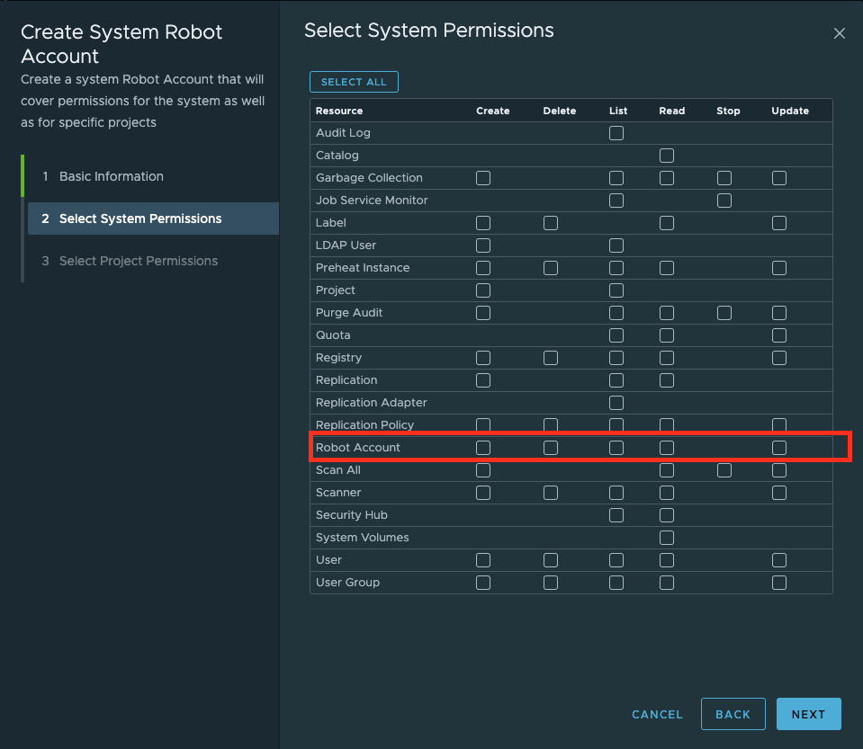

Proposal: Robot account permission enhancement

Author: Yan Wang

Discussion: [goharbor/harbor#20076](https://github.com/goharbor/harbor/issues/20076)

## Abstract

Since v2.10.0, robot accounts in Harbor have been restricted to specific permission scopes. This means that neither system nor project-level administrators can assign permissions to a robot account that fall outside of its designated scope.

## Motivation

Originally, the Harbor UI offered 16 permission options for users, but this was expanded to 40 in v2.10. To address security concerns, Harbor currently restricts the creation of robots with permissions related to user (normal and robot), group, and quota creation/deletion. However, this restriction has disrupted some users' existing pipelines that rely on robots with these prohibited permissions.

## Solution

This proposal suggests introducing a permission enhancement that allows admins to create robot accounts with a restricted permission set—introduced in v2.10—by specifying the selected permissions.
Additionally, by recording the creator of each robot account in the database and audit logs, this feature will help system administrators mitigate security concerns and ensure accountability.

## Non Goal

1. No support for configuring the prohibited permissions
2. No support for granting system configuration permission for a robot

## Personas and User Stories

This section lists the user stories for the different personas interacting with robot account.

* Personas

Robot Account is a System Administrator and Project Administrator operation in Harbor.

* User Stories

1. As a system administrator, I can enable or disable the prohibited scope set via a configuration option.
2. As a system/project administrator, I can create a project-level robot account with the selected access scope, including the prohibited scope set.
3. The creation and deletion of robot accounts will be recorded in the audit log.
4. As a system administrator, I can identify the creator of each robot account by performing an SQL query in the database.
5. A robot account can create another robot account, but the new account’s scope must be less than or equal to that of the creator.
6. A robot account created by another robot can only be updated or deleted by either the human with the relevant permissions, the creator of the robot account, or the robot account itself.

## Scheme Change

Add a new column of creator for table robot.

```
ALTER TABLE robot ADD COLUMN IF NOT EXISTS creator varchar(255);
UPDATE robot SET creator = 'unknown' WHERE creator IS NULL;
```

## Prohibited Permissions

1.  System Level

|   Resource    |    Action     | Enable |
|:-------------:|:-------------:|:------:|
| Configuration |     Read      |   N    |
| Configuration |    Update     |   N    |
|   ExportCVE   |     Read      |   Y    |
|   ExportCVE   |    Create     |   Y    |
|   LdapUser    |     List      |   Y    |
|   LdapUser    |    Create     |   Y    |
|  User-Group   |     List      |   Y    |
|  User-Group   |    Create     |   Y    |
|  User-Group   |     Read      |   Y    |
|  User-Group   |    Update     |   Y    |
|  User-Group   |    Delete     |   Y    |
|     Robot     |     Read      |   Y    |
|     Robot     | Update(self)  |   Y    |
|     Robot     |     List      |   Y    |
|     Robot     |    Create     |   Y    |
|     Robot     | Delete(self)  |   Y    |
|     User      |     Read      |   Y    |
|     User      |    Update     |   Y    |
|     User      |     List      |   Y    |
|     User      |    Create     |   Y    |
|     User      |    Delete     |   Y    |
|     Quota     |    Update     |   Y    |

2.  Project Level

| Resource  |    Action    | Enable |
|:---------:|:------------:|:------:|
|  Member   |     List     |   Y    |
|  Member   |    Create    |   Y    |
|  Member   |     Read     |   Y    |
|  Member   |    Update    |   Y    |
|  Member   |    Delete    |   Y    |
|   Robot   |     Read     |   Y    |
|   Robot   | Update(self) |   Y    |
|   Robot   |     List     |   Y    |
|   Robot   |    Create    |   Y    |
|   Robot   | Delete(self) |   Y    |

## UI




## Data provider

```go

// RobotPermissionProvider defines the permission provider for robot account
type RobotPermissionProvider interface {
	GetPermissions(s scope) []*types.Policy
}

// BaseProvider ...
type BaseProvider struct {
}

// GetPermissions ...
func (d *BaseProvider) GetPermissions(s scope) []*types.Policy {
	return PoliciesMap[s]
}

// NolimitProvider ...
type NolimitProvider struct {
	BaseProvider
}

// GetPermissions ...
func (n *NolimitProvider) GetPermissions(s scope) []*types.Policy {
	if s == ScopeSystem {
		return append(n.BaseProvider.GetPermissions(ScopeSystem),
			&types.Policy{Resource: ResourceRobot, Action: ActionCreate},
			&types.Policy{Resource: ResourceRobot, Action: ActionRead},
			&types.Policy{Resource: ResourceRobot, Action: ActionUpdate},
			&types.Policy{Resource: ResourceRobot, Action: ActionList},
			&types.Policy{Resource: ResourceRobot, Action: ActionDelete},
			
			...
	}
	if s == ScopeProject {
		return append(n.BaseProvider.GetPermissions(ScopeProject),
			&types.Policy{Resource: ResourceRobot, Action: ActionCreate},
			&types.Policy{Resource: ResourceRobot, Action: ActionRead},
			&types.Policy{Resource: ResourceRobot, Action: ActionUpdate},
			&types.Policy{Resource: ResourceRobot, Action: ActionList},
			&types.Policy{Resource: ResourceRobot, Action: ActionDelete},

            ...
	}
	return []*types.Policy{}
}


```